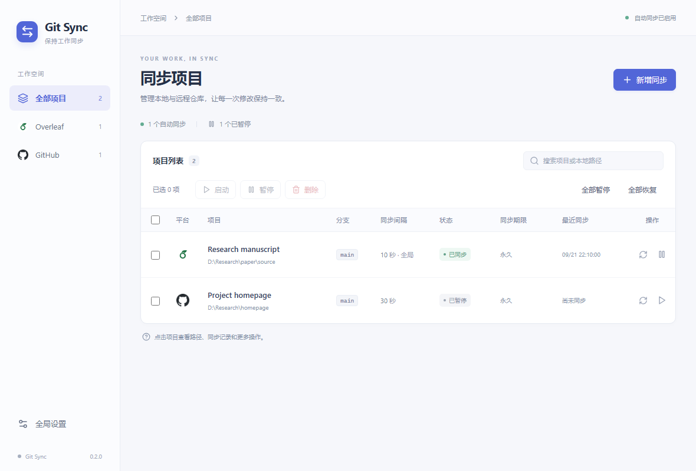
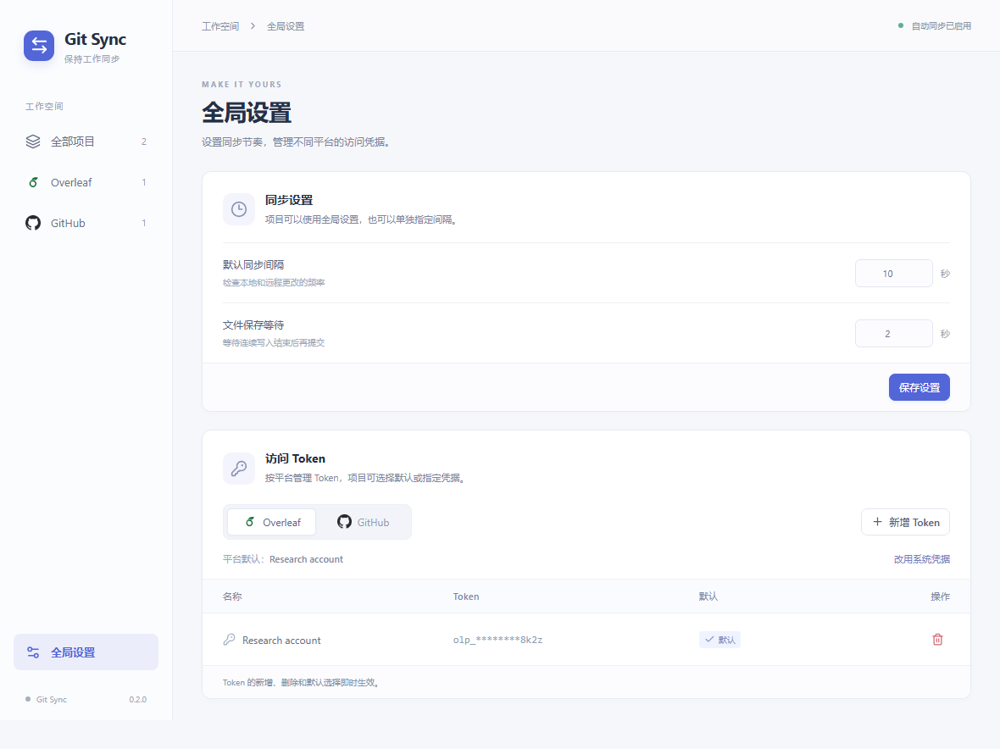

<div align="center">

# Git Sync

让本地仓库与 Overleaf、GitHub 保持同步的轻量桌面工具。

   

[English](README.md) · **简体中文**

</div>

Git Sync 在一个桌面窗口中管理 Git 双向同步。选择本地目录、平台和访问凭据，
设置同步间隔，即可按项目启用自动同步，也可以随时手动触发同步。

## ✨ 功能亮点

- 统一管理 Overleaf 和 GitHub 项目，支持平台筛选和搜索。
- 拉取远程更改、提交本地修改、合并兼容的历史并推送更新。
- 设置全局同步间隔，也可为单个项目指定间隔。
- 勾选项目批量启动、暂停或删除，也可一键暂停／恢复全部项目。
- 打开仓库目录、查看最近的同步记录。
- 每个平台可保存多个带名称的 Token，列表只展示首尾脱敏值。
- 项目可使用平台默认 Token、指定 Token，或系统 Git 凭据。
- 检测到冲突或未完成的 Git 操作时，停止自动合并并提示处理。
- 项目列表可按任意列排序。
- 支持跟随系统、浅色、深色三种主题。
- 使用 Windows 桌面程序，无需为运行安装 Python 或 Node.js。

## 📋 功能进度

- [x] 双向同步引擎（拉取、提交、合并、推送）
- [x] Overleaf 与 GitHub 平台
- [x] Token 管理
- [x] 批量管理（暂停、恢复、删除，全部暂停／全部恢复）
- [x] 同步期限（天、月、永久，到期暂停）
- [x] 项目列表按列排序
- [x] 主题设置（跟随系统／浅色／深色）
- [ ] Hugging Face 平台（计划中）
- [ ] Overleaf 空目录自动初始化（计划中）

## 🖼️ 界面预览





截图使用演示项目和脱敏的示例凭据。

## 🚀 快速开始

### 运行桌面程序

运行要求：

- Windows 10/11 x64。
- 已安装 [Git for Windows](https://git-scm.com/downloads/win)，并可通过 `PATH` 调用。
- 已安装 [Microsoft Edge WebView2 Runtime](https://developer.microsoft.com/microsoft-edge/webview2/)，较新的 Windows 通常已具备。
- 拥有远程仓库的 Git 访问权限；Overleaf 当前仍需要先克隆到本地。

如果已有构建好的安装包，运行 `Git Sync_0.1.0_x64-setup.exe`。
本地源码项目通过 `scripts/build.ps1` 构建完成后，也可以用 `Start.cmd` 打开编译好的程序。

### 添加项目

1. 在 **全局设置 → 访问 Token** 中添加凭据，也可以直接使用系统 Git 凭据。
2. 点击 **新增同步**，选择 **Overleaf** 或 **GitHub**。
3. 选择本地文件夹或输入尚未创建的完整目录路径。已有 Git 仓库会自动读取远程地址和当前分支。
4. 设置项目名称、Token，以及可选的独立同步间隔。
5. 选择是否启用自动同步，然后保存。普通目录非空时需确认后才初始化；取消会返回表单并保留填写内容，不修改目录。

当前界面语言为简体中文。GitHub 支持已有仓库、空目录、非空普通目录以及尚不存在的路径。
新目录会在保存时创建。初始化会下载远程文件并保留现有本地文件；同名文件保留本地版本，
作为基于远程历史的修改。启用同步后，这些修改会提交并上传。远程仓库为空时，在本地有文件后
创建并推送首次提交。文件与目录类型冲突时会停止初始化，不替换本地文件。

Overleaf 当前仍需要选择已有的本地克隆。已有 Git 仓库的远程地址和分支必须与任务设置一致。
自动提交前，请先配置 Git 的作者姓名和邮箱。

### 批量管理

项目最左侧可勾选，表头复选框选择当前筛选列表。批量按钮作用于勾选项目；全部暂停／全部恢复作用于所有项目，包括当前筛选隐藏的项目。切换筛选或搜索会清空勾选。

暂停会阻止后续自动同步，正在执行的一轮会先完成。恢复后按最多 4 个并发任务排队同步。删除需要确认，仅移除配置；正在同步的项目会跳过并提示。

### 同步期限

新项目默认同步一个自然月，也可选择 1–30 天、1–12 个月或永久。项目列表显示到期日期，悬停可查看准确时间。旧版本创建的项目保持永久。

到期后自动暂停并保留项目、本地文件与远程仓库；正在执行的一轮会先完成。程序关闭期间到期的项目，在下次启动时暂停。到期项目不能通过手动同步或全部恢复绕过期限。

编辑时默认保持当前期限。选择重新设置期限后，从本次保存开始计算所选时长，不叠加到原到期日；也可改为永久。只修改名称、Token 等信息不延长期限。按天以 24 小时计算，按月采用保存时本地时区的自然月，目标月没有对应日期时取月末。改为永久后不再到期。

## 🧭 同步机制

每轮同步依次检查仓库、拉取远程分支、等待本地文件保存稳定、提交本地更改、合并远程历史，
并在需要时推送。双方修改不存在冲突时，可以由 Git 自动合并。

| 行为 | 说明 |
| --- | --- |
| 默认间隔 | 10 秒，可为项目单独设置。 |
| 保存等待 | 默认 2 秒；文件仍在变化时延后同步。 |
| 本地修改 | 包括新增、修改、删除，以及已经暂存的内容。 |
| 忽略规则 | 排除未跟踪的忽略文件；已跟踪文件若匹配忽略规则，需要先检查。 |
| 合并冲突 | 保留冲突现场并暂停自动合并，手动解决或中止 Git 操作后再恢复。 |
| 网络或认证失败 | 显示错误；已启用的任务会按间隔重试。 |
| 删除项目 | 删除任务配置，保留本地文件和远程仓库。 |
| 窗口行为 | 最小化后继续同步；退出后停止，正在执行的 Git 操作需要先结束。 |

程序不执行强制推送或自动重置，也不负责 LaTeX 编译和网站构建。
同一个仓库应只启用一个自动同步工具，避免多个程序同时操作 Git。

## ⚙️ 设置与数据

两个平台各自拥有 Token 列表和可选的默认 Token。项目可以继承平台默认、单独指定 Token，
或使用系统 Git 凭据。被项目单独指定的 Token，需要先在对应项目中更换后才能删除。

应用数据保存在源码目录之外：

```text
%LOCALAPPDATA%/io.gitsync.desktop/
├─ config.json     全局设置、任务、Token 元数据和任务状态
├─ credentials/   由当前 Windows 用户保护的 Token 文件
├─ helpers/       Git 凭据辅助脚本
└─ logs/          各项目同步记录
```

移动源码项目不会移动或删除这些数据。在工具中删除 Token 只移除本地保存的副本，
不会撤销远程平台上的 Token。

## 🛠️ 开发与构建

安装 Node.js 22、通过 rustup 管理的 Rust，以及 [Tauri 在 Windows 上需要的 Microsoft C++ Build Tools](https://v2.tauri.app/start/prerequisites/)。
Rust 版本由 [rust-toolchain.toml](rust-toolchain.toml) 指定。

在项目根目录执行：

```powershell
npm.cmd ci
powershell -ExecutionPolicy Bypass -File scripts/dev.ps1
```

构建本地程序或 Windows 安装包：

```powershell
# 构建可执行文件，同时复制到 .local/bin/ 供 Start.cmd 使用
powershell -ExecutionPolicy Bypass -File scripts/build.ps1

# 构建可执行文件与 NSIS 安装包
powershell -ExecutionPolicy Bypass -File scripts/build.ps1 -Installer
```

安装包输出到 `src-tauri/target/release/bundle/nsis/`。

运行检查：

```powershell
npm.cmd run build
npm.cmd run test:engine
npx.cmd playwright install chromium
npm.cmd run test:ui
```

同步引擎测试使用临时本地仓库。界面测试使用演示数据，覆盖项目和 Token 管理、排序、主题、表格对齐及缩放。
Windows GitHub Actions 工作流会运行检查并上传安装包产物，不会自动发布 Release。

## 📁 项目结构

```text
git-sync/
├─ src/                 React 界面、组件与样式
├─ src-tauri/           Rust 桌面程序与同步引擎
├─ public/              平台图标
├─ tests/               浏览器界面测试
├─ scripts/             开发、构建和桌面冒烟测试辅助脚本
├─ docs/images/         README 截图
├─ .github/workflows/   Windows 检查与安装包构建
├─ README.md
└─ README.zh-CN.md
```

构建产物、本地可执行程序和测试报告均由 Git 忽略。
平台标识的来源说明见 [THIRD_PARTY_NOTICES.txt](THIRD_PARTY_NOTICES.txt)。
